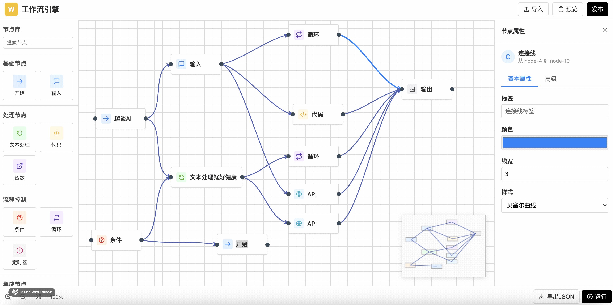

# 🚀 AI-Flow - 可视化工作流设计器

<div align="center">


**基于原生JavaScript的可视化工作流设计器，集成AI智能助手，让工作流设计更简单、更智能**

[在线演示](#-在线演示) • [快速开始](#-快速开始) • [功能特性](#-功能特性) • [技术架构](#-技术架构) • [更新日志](#-更新日志)

</div>

---

## 📸 项目演示



> **提示**：点击上方GIF查看完整演示效果，或访问在线演示体验完整功能

---

## ✨ 项目亮点

### 🎯 核心优势

- **🤖 AI智能辅助** - 自然语言生成工作流，智能优化建议，上下文感知节点推荐
- **🎨 可视化编辑** - 拖拽式节点创建，所见即所得的设计体验
- **⚡ 轻量级架构** - 纯原生JavaScript实现，无框架依赖，性能优异
- **🔧 高度可扩展** - 模块化设计，易于二次开发和功能扩展
- **🎬 流畅动画** - 丰富的交互动画和过渡效果，提升用户体验
- **📊 完整功能** - 支持预览、导出、缩放、缩略图等专业功能

### 🏆 技术特色

- ✅ **零依赖核心** - 仅使用jsPlumb进行连接绘制，核心逻辑完全自主实现
- ✅ **AI算法集成** - 关键词匹配、规则引擎、智能分析等多维度AI能力
- ✅ **响应式设计** - 适配不同屏幕尺寸，提供优秀的跨设备体验
- ✅ **性能优化** - DOM操作优化、事件委托、硬件加速等多项性能优化

---

## 🎯 功能特性

### 📦 节点系统

支持**12种**不同类型的工作流节点，覆盖常见业务场景：

| 节点类型 | 图标 | 用途 | 颜色主题 |
|---------|------|------|---------|
| 🚀 **开始** | → | 工作流起始节点 | 蓝色 |
| ⌨️ **输入** | 💬 | 接收用户或系统输入 | 天蓝色 |
| ⚙️ **文本处理** | 🔄 | 数据格式转换和处理 | 绿色 |
| 💻 **代码** | `</>` | 自定义代码执行 | 橙色 |
| ❓ **条件** | ❓ | 条件分支判断 | 红色 |
| 🔁 **循环** | 🔁 | 循环处理逻辑 | 紫色 |
| 💾 **数据库** | 💾 | 数据库操作 | 深蓝色 |
| 🌐 **API** | 🌐 | HTTP API调用 | 青色 |
| 📤 **输出** | 📤 | 结果输出 | 灰色 |
| ⏰ **定时器** | ⏰ | 定时触发任务 | 粉色 |
| 🔔 **通知** | 🔔 | 消息通知发送 | 黄色 |
| 📦 **函数** | 📦 | 函数调用 | 紫色 |

### 🤖 AI智能助手

#### 1. **智能生成工作流**
- 📝 自然语言描述需求，AI自动生成完整工作流
- 🎯 支持多种场景模板（登录流程、数据处理、定时任务等）
- 🎬 生成过程可视化，带动画效果

#### 2. **智能优化分析**
- 🔍 自动检测工作流问题（孤立节点、缺少开始节点等）
- 📊 性能评分和优化建议
- 💡 架构改进建议（错误处理、重试机制等）

#### 3. **上下文节点推荐**
- 🎯 基于当前选中节点，智能推荐下一个节点
- 📋 推荐理由说明，帮助理解节点关系
- ⚡ 一键添加推荐节点并自动连接

#### 4. **AI对话助手**
- 💬 自然语言交互，解答工作流设计问题
- 🎓 提供最佳实践和专业建议
- 🔧 支持命令执行和操作指导

### 🎨 可视化编辑

- **拖拽创建** - 从左侧面板拖拽节点到画布即可创建
- **连接绘制** - 点击节点端点自动绘制连接线
- **属性编辑** - 右侧面板实时编辑节点和连接属性
- **样式定制** - 支持4种节点样式（默认、现代、扁平、圆角）
- **连接线样式** - 支持贝塞尔曲线、直线、流程图等多种样式

### 📊 预览与导出

- **可视化预览** - 完整的工作流预览，支持交互操作
- **JSON导出** - 导出标准JSON格式，便于保存和分享
- **工作流信息** - 显示节点数量、连接数量等统计信息
- **节点列表** - 清晰的节点列表展示

### 🔧 画布操作

- **缩放控制** - 支持放大、缩小、重置，快捷键Ctrl+滚轮
- **缩略图导航** - 右下角缩略图，快速定位和导航
- **网格背景** - 可自定义网格大小和颜色
- **背景设置** - 支持网格和纯色两种背景模式

---

## 🏗️ 技术架构

### 整体架构

```
┌─────────────────────────────────────────────────────┐
│                   前端展示层                          │
│  ┌──────────┐  ┌──────────┐  ┌──────────┐          │
│  │ 节点面板  │  │ 画布区域  │  │ 属性面板  │          │
│  └──────────┘  └──────────┘  └──────────┘          │
└─────────────────────────────────────────────────────┘
                        ↓
┌─────────────────────────────────────────────────────┐
│                   业务逻辑层                          │
│  ┌──────────┐  ┌──────────┐  ┌──────────┐          │
│  │ 节点管理  │  │ 连接管理  │  │ 状态管理  │          │
│  └──────────┘  └──────────┘  └──────────┘          │
└─────────────────────────────────────────────────────┘
                        ↓
┌─────────────────────────────────────────────────────┐
│                  AI智能模块                           │
│  ┌──────────┐  ┌──────────┐  ┌──────────┐          │
│  │ 流程生成  │  │ 智能优化  │  │ 节点推荐  │          │
│  └──────────┘  └──────────┘  └──────────┘          │
└─────────────────────────────────────────────────────┘
                        ↓
┌─────────────────────────────────────────────────────┐
│                   底层支撑层                          │
│  ┌──────────┐  ┌──────────┐  ┌──────────┐          │
│  │ jsPlumb  │  │ DOM操作   │  │ 事件系统  │          │
│  └──────────┘  └──────────┘  └──────────┘          │
└─────────────────────────────────────────────────────┘
```

### 技术栈

| 技术 | 版本/说明 | 用途 |
|------|----------|------|
| **JavaScript** | ES6+ | 核心业务逻辑实现 |
| **HTML5** | - | 页面结构和语义化 |
| **CSS3** | - | 样式、动画和响应式布局 |
| **jsPlumb** | Community Edition | 节点连接和拖拽功能 |

### 核心模块

#### 1. **节点管理模块**
- 节点创建、更新、删除、选择
- 节点数据持久化
- 节点样式管理

#### 2. **连接管理模块**
- 基于jsPlumb的连接绘制
- 连接线样式自定义
- 连接验证和约束

#### 3. **画布管理模块**
- 缩放和平移控制
- 背景设置（网格/纯色）
- 缩略图实时更新

#### 4. **AI智能模块**
- **工作流生成器** - 自然语言解析和流程生成
- **智能优化引擎** - 结构分析和性能优化
- **节点推荐系统** - 上下文感知推荐
- **AI对话助手** - 自然语言交互

#### 5. **属性面板模块**
- 节点属性编辑
- 连接线属性编辑
- 高级配置（超时、重试、优先级等）

### 设计模式

- **模块化设计** - 功能模块清晰分离，易于维护
- **事件驱动** - 基于DOM事件和自定义事件通信
- **单例模式** - jsPlumb实例统一管理
- **工厂模式** - 节点创建统一入口
- **观察者模式** - 节点选择和更新通知

### 数据结构

#### 节点数据结构
```javascript
{
    id: "node-1",
    type: "code",
    position: { x: 100, y: 100 },
    data: {
        name: "代码处理",
        code: "console.log('Hello')",
        description: "处理数据",
        timeout: 5000,
        retryCount: 0,
        retryDelay: 1000,
        enabled: true,
        priority: "medium",
        tags: ["processing"],
        style: "default"
    }
}
```

#### 工作流数据结构
```javascript
{
    metadata: {
        name: "我的工作流",
        description: "描述",
        version: "1.0.0",
        permission: "private",
        createdAt: "2024-01-01T00:00:00Z"
    },
    nodes: [...],
    connections: [...],
    backgroundSettings: {
        type: "grid",
        color: "#ffffff",
        gridSize: 20,
        gridColor: "#e0e0e0"
    }
}
```

---

## 🚀 快速开始

### 环境要求

- 现代浏览器（Chrome 80+, Firefox 75+, Safari 13+, Edge 80+）
- 支持ES6+语法
- 支持CSS Grid和Flexbox

### 安装方式

#### 方式一：直接使用（推荐）

1. **克隆项目**
```bash
git clone <repository-url>
cd flow
```

2. **打开项目**
```bash
# 直接打开index.html
open index.html

# 或使用本地服务器（推荐）
python -m http.server 8000
# 然后访问 http://localhost:8000
```

#### 方式二：集成到现有项目

1. **复制文件**
```bash
# 复制以下文件到你的项目
- index.html
- script.js
- styles.css
- draw.js (jsPlumb库)
```

2. **引入依赖**
```html
<!-- 在HTML中引入 -->
<link rel="stylesheet" href="styles.css">
<script src="draw.js"></script>
<script src="script.js"></script>
```

### 使用示例

#### 基础使用

```javascript
// 创建节点
const node = window.workflowAPI.createNode('code', 100, 100);

// 更新节点数据
window.workflowAPI.updateNodeData(node.id, {
    name: '我的代码节点',
    code: 'console.log("Hello World");'
});

// 获取所有节点
const nodes = window.workflowAPI.getNodes();

// 导出工作流
const workflow = {
    nodes: window.workflowAPI.getNodes(),
    connections: window.workflowAPI.getConnections()
};
```

#### AI功能使用

```javascript
// 生成工作流
const workflow = await generateWorkflowFromPrompt('创建一个用户登录流程');

// 优化工作流
const analysis = await analyzeAndOptimizeWorkflow(nodes, connections);

// 获取节点推荐
const suggestions = getNodeSuggestions('start');
```

---

## 📖 使用指南

### 创建节点

1. **拖拽创建**：从左侧节点面板拖拽节点类型到画布
2. **点击编辑**：点击节点打开右侧属性面板
3. **配置属性**：在属性面板中编辑节点名称、代码、描述等

### 连接节点

1. **自动连接**：点击源节点的右侧端点，拖拽到目标节点的左侧端点
2. **编辑连接**：点击连接线，在属性面板中编辑标签、颜色、样式
3. **删除连接**：选中连接线后按Delete键

### 使用AI助手

1. **打开AI面板**：点击右下角悬浮的AI助手按钮
2. **生成工作流**：在"生成流程"标签页输入需求描述
3. **智能优化**：在"智能优化"标签页分析当前工作流
4. **节点推荐**：选中节点后，在"节点推荐"标签页查看推荐
5. **AI对话**：在"AI对话"标签页与助手交互

### 导出工作流

1. **预览工作流**：点击工具栏的"预览"按钮
2. **查看JSON**：在预览面板切换到"JSON结构"标签
3. **导出JSON**：点击"导出JSON"按钮下载工作流文件

---

## 🔧 扩展开发

### 添加新节点类型

```javascript
// 1. 添加节点图标
nodeTypeIcons['newType'] = `<svg>...</svg>`;

// 2. 添加节点颜色
nodeTypeColors['newType'] = '#your-color';
nodeTypeTextColors['newType'] = '#your-text-color';

// 3. 添加节点名称
function getNodeName(type) {
    const nameMap = {
        newType: '新节点类型'
    };
    return nameMap[type] || '节点';
}
```

### 接入真实AI服务

```javascript
async function generateWorkflowFromPrompt(prompt) {
    // 替换为真实API调用
    const response = await fetch('/api/ai/generate', {
        method: 'POST',
        headers: {
            'Content-Type': 'application/json'
        },
        body: JSON.stringify({ prompt })
    });
    
    const workflow = await response.json();
    return workflow;
}
```

### 自定义节点样式

```javascript
const nodeStyles = {
    custom: {
        name: '自定义样式',
        className: 'node-style-custom'
    }
};
```

更多扩展开发指南，请参考 [技术文档](./doc.md)

---

## 🌐 在线演示

- **在线体验**：[点击访问在线演示](#)（待部署）
- **演示视频**：查看项目根目录的 `demo.gif`

---

## 📊 项目统计

- **代码行数**：~2500+ 行
- **节点类型**：12种
- **AI功能**：4大模块
- **动画效果**：10+ 种
- **浏览器支持**：Chrome、Firefox、Safari、Edge

---

## 🤝 贡献指南

欢迎贡献代码、提出建议或报告问题！

### 贡献方式

1. **Fork** 本仓库
2. **创建** 特性分支 (`git checkout -b feature/AmazingFeature`)
3. **提交** 更改 (`git commit -m 'Add some AmazingFeature'`)
4. **推送** 到分支 (`git push origin feature/AmazingFeature`)
5. **开启** Pull Request

### 代码规范

- 使用ES6+语法
- 遵循现有代码风格
- 添加必要的注释
- 确保浏览器兼容性

---

## 📝 更新日志

### v1.0.0 (2025-11)

#### ✨ 新功能
- 🎨 支持12种节点类型（开始、输入、文本处理、代码、条件、循环、数据库、API、输出、定时器、通知、函数）
- 🤖 集成AI智能助手（生成工作流、智能优化、节点推荐、AI对话）
- 🎬 添加生成动画效果（节点创建动画、连接线动画、进度提示）
- 📊 支持工作流预览和JSON导出
- 🔧 支持画布缩放、缩略图导航
- 🎨 支持4种节点样式（默认、现代、扁平、圆角）
- 📝 支持连接线样式自定义（贝塞尔曲线、直线、流程图等）

#### 🐛 修复
- 修复节点拖拽时的文本选择问题
- 修复连接线选中状态显示
- 优化缩略图更新性能

#### 📚 文档
- 完善README文档
- 添加技术文档（doc.md）

---

## 🔗 相关项目

我们团队还开发了以下优秀的在线办公解决方案：

1. **[flowmix/docx 多模态文档编辑器](https://flowmix.turntip.cn)** - 支持多模态内容的文档编辑器
2. **[灵语AI文档](https://mindlink.turntip.cn)** - AI驱动的智能文档平台
3. **[JitWord 在线协同文档编辑器](https://jitword.com)** - 实时协同的在线Word编辑器
4. **[pxcharts 多维表格编辑器](http://pxcharts.com)** - 强大的多维表格编辑工具
5. **[H5-Dooring智能零代码平台](https://github.com/MrXujiang/h5-Dooring)** - 零代码H5页面搭建平台

---

## 📄 许可证

本项目采用 [MIT License](./LICENSE) 许可证。

---

## 👥 作者与支持

- **作者**：趣谈AI团队
- **微信**：cxzk_168
- **公众号**：趣谈AI（获取更多技术干货和项目进展）

### 关注我们

关注【趣谈AI】公众号，获取：
- 📚 更多技术干货
- 🚀 项目最新进展
- 💡 开源实践分享
- 🎯 行业最佳实践

---

## ⭐ Star History

如果这个项目对你有帮助，欢迎给个 Star ⭐️

[](https://star-history.com/#your-username/ai-flow&Date)

---

## 🎯 未来规划

### 短期目标
- [ ] 接入真实AI大模型（GPT-4/Claude）
- [ ] 支持工作流导入功能
- [ ] 增加更多节点类型
- [ ] 支持节点分组功能
- [ ] 添加撤销/重做功能

### 长期目标
- [ ] 工作流执行引擎
- [ ] 多人协作编辑
- [ ] 版本控制系统
- [ ] 工作流模板市场
- [ ] 移动端适配
- [ ] 插件系统

---

<div align="center">

**Made with ❤️ by 趣谈AI团队**

[⬆ 回到顶部](#-ai-flow---可视化工作流设计器)

</div>
